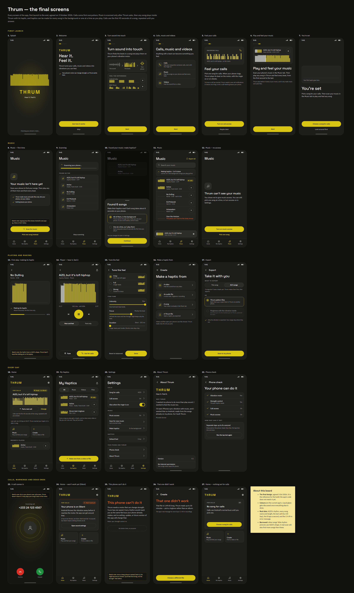

# Thrum

**Hear it. Feel it.**

Thrum turns sound into something you can feel. When someone calls, your phone vibrates to the rhythm of a song you picked, instead of the same flat buzz every Android phone makes. And you can play the music on your phone inside Thrum and feel every beat.

iPhones can do this. Android phones have the hardware for it and leave it switched off.



## What it does

- **Calls come first.** Pick one song for your calls. When the phone rings, you feel the first 45 seconds of it, repeated until you answer. It works in vibrate mode, and in ring mode too if you leave that switch on.
- **Music.** Tap "Scan for music", say yes when Thrum asks, and it lists the songs and audio files on your phone. Play any of them and feel the beat from start to finish. Thrum can make every song's haptic in the background, or one at a time as you play them.
- **Videos and audio files.** Pick a video or a recording and Thrum turns its sound into a haptic as well.
- **Thrum Originals.** A few pieces made for Thrum and built into the app, so you can feel it the moment you open it, before giving any permission.
- **A music catalog (planned).** Search and play music that isn't on your phone, with its vibration. It needs the internet, which Thrum doesn't use today, so it waits on that decision.
- **Clean up the sound.** When a song is a squashed, low-quality copy, Thrum can make it sound clearer, on the phone.
- **My Haptics.** Everything you make, in one list. Use any of it for calls, tune how it feels, or export it.
- **Tune the feel.** Three presets (Crisp, Full and Strong) and three dials: Intensity, Focus and Duration.
- **Export.** Save one haptic or all of them as Thrum files, to back them up or open them in Thrum on another phone. Only the vibration goes in the file, never the song.

## How it works

Thrum reads the song and finds where the beats land. Then it writes down how hard the motor should push for every 20 milliseconds of it. That list is a vibration score, and your phone's vibration motor plays it: in time with the music when you're listening, or on its own when someone calls.

## Where it is now

- **Working today on a Pixel 6 Pro: the calls feature.** Real incoming calls play a chosen song's rhythm, in vibrate mode and in ring mode. Thrum starts it within a second of the call arriving, usually in about a third of a second.
- **Designed, not built yet: everything else on this page.** The screens are agreed (the picture above) and [PLAN.md](PLAN.md) lists the build, one task at a time.
- **The open problem:** on the Pixel the rhythm still feels too much like a steady hum and not enough like a beat. That is the next task.
- Not on the Play Store yet.

## The plan

Built in this order, one task at a time, each one proven on a real phone before the next starts. The task numbers match [PLAN.md](PLAN.md).

| Step | Tasks | What gets built |
|---|---|---|
| 1 | 15 | Fix the feel: a beat you notice, not a hum |
| 2 | 16 | Test a whole song's vibration on the phone, including with the screen off |
| 3 | 17 | Choose how haptics are stored, how background work runs, and which player plays songs |
| 4 | 18–19 | The new app: first launch, Home and calls |
| 5 | 20–22 | Music: scanning, the player, making haptics |
| 6 | 23–26 | Videos and files, My Haptics, tuning, export, settings |
| 7 | 27–29 | Thrum Originals, the music catalog and Clean up |
| 8 | 10, 6, 13, 14 | A day-long reliability test, a cheap-phone test, the store listing, launch |

## Still to decide

- **Whether Thrum may use the internet**, which the music catalog needs. Thrum has none today and promises it never will, so this is a real change.
- **Where the catalog's music comes from.** It has to be licensed: nothing gets ripped from YouTube or Spotify.
- **Who makes the Thrum Originals.**
- **Five building choices**, each written up with a suggestion and an alternative in [PROFILE.md](PROFILE.md) §7.

## What you need

- **A phone whose vibration motor can change strength:** Pixels, Samsung flagships and similar phones. Phones with the older one-speed motor can only buzz, so Thrum checks your phone first and tells you plainly if it can't help.
- **Android 12 or newer.**

## Privacy

Thrum has no internet permission. Your music, your haptics and your calls stay on your phone, unless you export a haptic yourself, and an export holds only the vibration. Thrum asks before it looks at your music, and it only reads music and audio files. To notice a call, it checks one thing in your notifications: is this a call? It ignores the rest. If the planned catalog gets built, it will be the one part of Thrum that uses the internet, and this section will say exactly what it sends.

## What it can't do

- **Make Spotify, YouTube Music, TikTok or WhatsApp calls vibrate.** Android doesn't let one app reach another app's audio. Thrum plays the files on your phone, inside Thrum.
- **Vibrate in Silent mode.** Android throws the vibration away there before it reaches the motor. Use Vibrate.
- **Change your phone's call screen.** That belongs to your phone. Thrum only moves the motor.
- **Skip Android's own buzz at the very start of a call.** Android starts its flat buzz first, and Thrum's rhythm takes over about half a second later.

## More detail

- [docs/features-explained.md](docs/features-explained.md): every feature in plain words, and how each one gets built.
- [docs/design/screens](docs/design/screens/thrum-screens.png): all 33 screens, first launch to the end.
- [PROFILE.md](PROFILE.md): the full description of the app, its rules, and everything measured so far.
- [PLAN.md](PLAN.md): every task, with the proof each one needs.
- [docs/device](docs/device): measurements taken on the phone itself.

## Building it

[CLAUDE.md](CLAUDE.md) has the setup. Once that's done, one command runs the tests and builds the app:

```powershell
powershell -File check.ps1
```

## Licence

Not decided yet.
